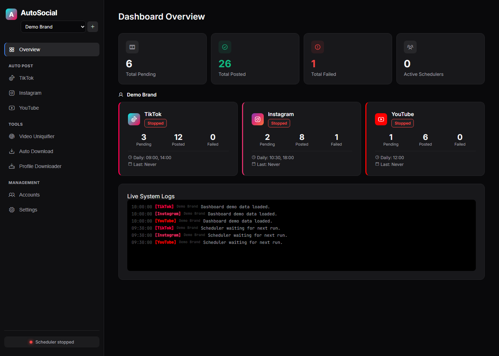

# AutoSocial Studio

[](https://github.com/Katzca/AutoSocial/actions/workflows/ci.yml)
[](LICENSE)
[](package.json)

AutoSocial Studio is a local, multi-account automation dashboard for short-form
video workflows across TikTok, Instagram, and YouTube. It combines a local
Express dashboard, Playwright-powered upload flows, per-account queues,
schedulers, yt-dlp downloader utilities, and an FFmpeg-based video uniquifier.

This project is built for a local workstation. It is not a hosted SaaS app and
does not include user authentication.



## Why This Exists

AI coding tools make it easier than ever for indie builders to ship products.
Distribution is still the hard part. AutoSocial Studio helps builders turn
launch clips, demos, product updates, and short-form experiments into a
repeatable local marketing workflow without handing account sessions to a
hosted service.

The goal is not mass posting or engagement spam. The goal is a practical
creator operations dashboard: organize accounts, prepare queues, schedule
posts, reuse captions, download reference material, and process videos from one
local control plane.

## Who It Helps

- Indie hackers launching multiple products.
- AI builders who need a repeatable content workflow after shipping with AI
  coding tools.
- Small teams that want local browser sessions instead of a hosted service
  storing account credentials.
- Maintainers and contributors experimenting with responsible automation around
  product updates, demos, and community content.

## Autonomous local workflow

The dashboard listens only on **http://localhost:3028** and does not require a username or password. It cannot be bound to the LAN.

- Schedule a specific queued TikTok video for an exact future date and time.
- Jobs and reserved videos survive application and Windows restarts.
- Each AutoSocial account has an isolated Google Flow Chromium profile, fixed prompt template, Gemini-powered dynamic instructions, reference image, timezone and daily plan.
- The fixed template uses `{{dynamic}}`; Gemini creates one original, previously unused phrase for every requested video and the final prompt is previewable before generation.
- Flow generates up to three **9:16 portrait** videos daily, validates their dimensions, keeps permanent playable copies under `downloads/google-flow/<account>/<job>/`, and separately reserves copies for future TikTok publication jobs.
- Interrupted publications become `uncertain` and are never retried blindly, preventing accidental duplicate posts.

Install on Windows with `powershell -ExecutionPolicy Bypass -File scripts\install.ps1`, then start with `powershell -ExecutionPolicy Bypass -File scripts\start.ps1`. The start script waits for the dashboard and opens `http://localhost:3028` in Brave when available or in the Windows default browser. Complete the first TikTok and Google Flow logins from Accounts and Google Flow before enabling daily automation.

Google Flow is automated through its browser interface. The Flow driver supports the current Slate prompt editor, Material `arrow_forward` Create control, classic Video settings, and the remembered Agent-mode toggle that otherwise hides video controls. Failed Flow windows remain open temporarily with private screenshot/JSON diagnostics instead of closing immediately. Dynamic phrases use the Gemini API and require a key from [Google AI Studio](https://aistudio.google.com/app/apikey), saved separately for each local account. The key is never returned to the dashboard after saving. Login challenges, CAPTCHA, quota limits, moderation and interface changes are not bypassed; the job fails visibly and can be retried after the user resolves the issue.

## AI Long-form Studio

The `AI Long Video` sidebar view is an account-scoped local production studio for stories, mini-films, documentaries, educational videos, and narrative ads. It provides:

- Versioned briefs, structured scripts, visual bibles, reference sets, storyboards, approval gates, history inspection, and restore-as-new-version.
- Deterministic local preproduction plus optional Gemini generation when an account key is configured. Gemini quota or billing is controlled by the connected Google account; the application does not enable a paid fallback.
- Immutable chunked media imports up to 2 GiB, validated CUBE LUTs, SHA-256 provenance, account isolation, persistent jobs, and generated proxies.
- A non-destructive multi-track timeline with automatic rough-cut assembly, trim/split/move/ripple delete, snapping, animated transform and core grade keyframes, undo/redo, LUTs, scopes, audio roles, pan/ducking/normalization, and styled SRT/VTT captions.
- Local speech through Windows System.Speech or espeak-ng, deterministic local music/SFX generation, FFmpeg waveform/vectorscope analysis, and clearly labeled local relighting grades.
- SQLite/WAL persistence, optimistic revisions, editable versioned production DAGs, durable events/jobs, leases/heartbeats, render records, and restart-safe publication handoffs.
- Verified local FFmpeg rendering for overlays, animated transforms/core grades, advanced static color controls, CUBE LUTs, audio mixing/pan/ducking/limiting/loudness normalization, embedded or animated burned captions, H.264/HEVC, and 1080p/4K horizontal or vertical presets.
- Google Flow storyboard-shot jobs through the existing authenticated browser adapter in batches of up to three 9:16 shots. Quota, login, moderation, and UI changes remain external runtime constraints.
- Scheduled or immediate handoff to account-scoped YouTube, TikTok, and Instagram queues with correlation manifests and explicit remote confirmation receipts. A handoff is never reported as a remote publication.
- Local React/TypeScript, icons, and fonts. No Studio frontend script is loaded from a CDN.

Final 1080p/4K rendering is gated below 100 GiB free; 250 GiB on an SSD is recommended for long projects. Preview renders require 1 GiB. FFmpeg and ffprobe must be available in `PATH`; local speech additionally needs Windows System.Speech or espeak-ng. Run `npm run doctor` for executable, codec/filter, SQLite, browser, writable-root, speech, and exact-volume checks. Provider-dependent work stops visibly when login, quota, media, or a required tool is unavailable and never simulates output.

`npm run validate:studio-media` performs a deterministic media smoke test. Add `-- --4k` or `-- --4k --vertical` for short 4K validation. A 60-minute soak requires `AUTOSOCIAL_ALLOW_LONG_SOAK=1 npm run validate:studio-media -- --soak --keep --output <folder>` and qualified Windows hardware. Short Linux 4K tests do not prove Windows 60-minute performance.

## Features

- Manage multiple brands/accounts with isolated queues and browser sessions.
- Prepare one TikTok account record per seven days from the Accounts view: Chromium opens EZ Temp Mail and TikTok in two tabs, captures the generated mailbox and recovery key, and generates a strong TikTok password.
- Keep every prepared account's email, recovery key, access token, and TikTok password together in `account-vault.json`. The complete vault payload is encrypted with Windows DPAPI for the current Windows user; secrets are revealed only on an explicit Copy action.
- Use the First-Run Setup page to verify local dependencies, login sessions,
  and queue folders.
- Post queued videos to TikTok, Instagram, and YouTube.
- Persist Playwright login sessions under `.profiles/<account>/<platform>`.
- Schedule posts with cron expressions, daily times, or instant-post mode.
- Download recent TikTok videos with yt-dlp and fan them out into queues.
- Scan/download TikTok profiles into `autodownload/profile_downloads`.
- Run FFmpeg-based video uniquification from the dashboard or CLI, with an
  optional user-provided logo overlay.

## Requirements

- Node.js 18+
- npm
- Playwright Chromium
- FFmpeg and ffprobe in `PATH`
- Optional: `yt-dlp.exe` in `autodownload/` for downloader features

Windows is the primary target for the bundled `yt-dlp.exe` workflow, but the
dashboard and core Node services are ordinary Node.js.

## Quick Start

```bash
npm ci
npm run build:studio
npx playwright install chromium
npm run doctor
```

Create your local environment file:

```powershell
Copy-Item .env.example .env
```

Start the dashboard:

```bash
npm run dashboard
```

Open http://localhost:3028.

Start with the `Setup` view. It checks local dependencies and shows the exact
pending folders where videos should be dropped for each platform.

## Configuration

Copy `.env.example` to `.env` and review the values that matter for your
workflow.

Common settings:

- `CRON_EXPRESSION`, `INSTAGRAM_CRON_EXPRESSION`, `YOUTUBE_CRON_EXPRESSION`
- `TZ`, `BROWSER_LOCALE`
- `HEADLESS`
- `POST_DELAY_MS`, `POST_PUBLISH_HOLD_MS`, `FAILURE_HOLD_MS`
- `AUTO_ADD_SOUND`, `DEFAULT_SOUND_QUERY`
- `RANDOM_QUEUE_ORDER`
- `DEFAULT_CAPTION`
- `UNIQUIFY_LOGO_IMAGE`
- `WATCH_CHANNEL`, `WATCH_INTERVAL`, `WATCH_MAX_VIDEOS`, `WATCH_MIN_VIEWS`
- `AUTO_POST_PLATFORMS`
- `AUTONOMOUS_POLL_MS`
- `STUDIO_ROOT`, `STUDIO_DATABASE_PATH`

Hashtag captions in `.env` should be quoted:

```env
DEFAULT_CAPTION="#mybrand #shorts"
```

The sample config ships without a default caption, watch channel, logo, or
sound query. Set those in `.env` or in the dashboard for your own workflow.

## Dashboard Security

The dashboard binds to `127.0.0.1:3028` and has no authentication layer.
Keep it local.

Mutating dashboard requests include a same-origin guard so random websites
cannot blindly trigger local dashboard actions through the browser.

The address is fixed at `127.0.0.1:3028`. Remote binding is not supported.

See [SECURITY.md](SECURITY.md) for more details.

## First-Time Login

The Accounts view lists every local TikTok account. **Prepare account with temp mail** creates a new isolated local profile, opens [EZ Temp Mail](https://www.eztempmail.com/) and the official TikTok signup page in two Chromium tabs, captures the temporary email and recovery key, and saves those values with a generated TikTok password. This preparation is limited to one new record every seven days.

TikTok registration itself remains visible and user-controlled. AutoSocial does not submit the registration form, solve CAPTCHA, bypass verification, or accept platform terms for you. When the registration is complete, its Chromium profile is reused for posting.

The account credential document is `account-vault.json`. Its full contents are encrypted with Windows DPAPI and can only be decrypted by the same Windows user. Do not move the file as a credential backup without also retaining access to that Windows profile.

Open the dashboard, go to `Accounts`, and start a login session for each
platform you want to use. Sessions are stored on disk and reused between runs.

The CLI `login` command is still TikTok-specific:

```bash
npm run login
```

## Queue Layout

Queues are account-aware:

```text
queue/<account>/tiktok/pending
queue/<account>/instagram/pending
queue/<account>/youtube/pending
```

Successful uploads move into `posted`; failed uploads move into `failed`.

Supported video extensions:

- `.mp4`
- `.mov`
- `.webm`
- `.avi`
- `.mkv`

Caption sidecars can use the same base filename:

- `.description`
- `.txt`

## Commands

```bash
npm run dashboard
npm run clean:debug
npm run doctor
npm run check
npm run login
npm run post
npm run daemon
npm run uniquify
npm run video-info -- --video "C:\path\video.mp4"
npm run autodownload
```

Notes:

- The dashboard is the preferred workflow.
- `clean:debug` removes local debug screenshots and dashboard logs only.
- `login`, `post`, and `daemon` are TikTok CLI flows.
- Instagram and YouTube posting are managed through the dashboard.
- `uniquify` and `video-info` require FFmpeg and ffprobe.
- `autodownload` requires yt-dlp.

## Development

Run the local checks:

```bash
npm run check
npm audit --omit=dev
```

The test suite focuses on local logic that does not require live social
platform access: queue handling, sidecars, filesystem archiving, scheduler time
logic, and config parsing.

## Runtime Data

Do not commit local runtime data. The `.gitignore` covers known generated paths,
including:

- `.env`
- `.profiles/`
- `.scheduler-state/`
- `*-state.json`
- `queue/`
- `downloads/`
- `user-assets/`
- `autodownload/downloads/`
- `autodownload/profile_downloads/`
- `autodownload/info.json`
- `last-*.png`

Before publishing a fork, inspect `git status --short` and `git status
--ignored`.

## Responsible Use

Users are responsible for complying with platform terms, account policies, rate
limits, local law, and content rights. This project does not grant permission to
post content you do not own or have permission to use.

Prefer official platform APIs where they are available for your workflow. Avoid
spam, deceptive behavior, unauthorized scraping, and posting without consent.
Keep sessions local, rotate credentials if they are exposed, and review
platform limits before enabling scheduled automation.

## X Autopilot

The local dashboard includes an X Autopilot view with per-account settings,
scheduled posts, an AI prompt, reference posts, queue clearing, and two content
modes: AI generation or recent X search followed by an original rewrite. Free
accounts are limited to 280 characters and Premium accounts to 4000 characters.
The recent-search mode uses X's official recent search endpoint and requires a
Bearer Token. It does not copy a target post verbatim.

X posting starts in Simulation mode. Simulation never sends a request to X. To
publish for real, select Live and provide an OAuth 2 User Access Token with
Write permission. A Bearer Token is for search and read operations; it cannot
publish posts. If Live is selected without a User Access Token, the queue item
fails visibly instead of being reported as simulated.

The AI provider can be OpenAI, Google Gemini, or DeepSeek. OpenAI and DeepSeek
use an OpenAI-compatible chat-completions request; Gemini uses its
`generateContent` API. API keys are stored in the local ignored runtime state
file and are never returned to the browser. Leaving a key field blank keeps
the previously stored key.

## Roadmap

See [ROADMAP.md](ROADMAP.md) for planned work around safer automation controls,
official API integrations, creator workflow templates, and maintainer tooling.

## License

MIT. See [LICENSE](LICENSE).
